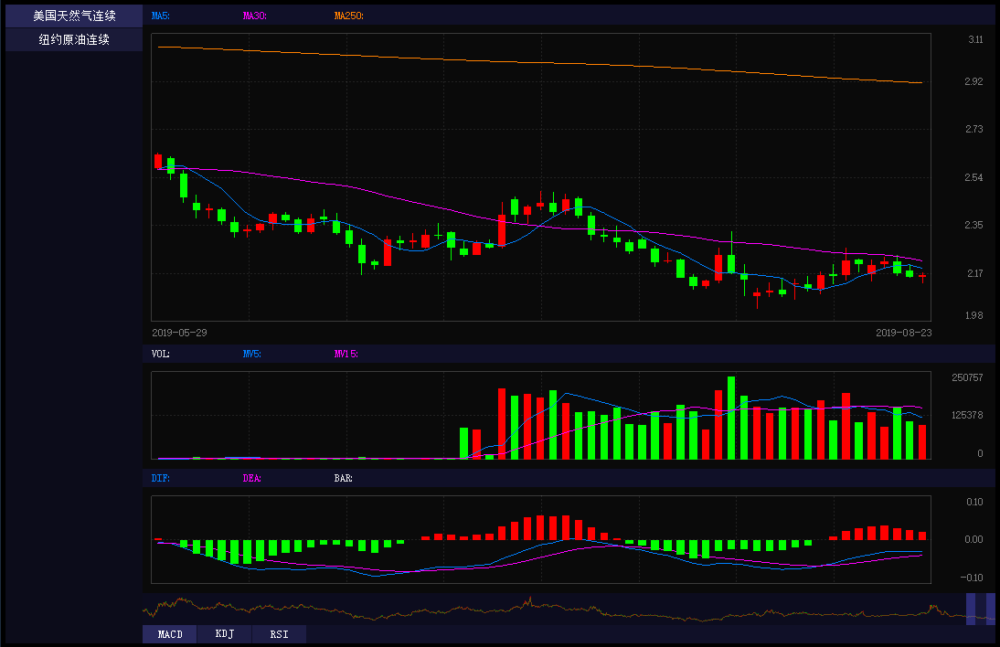

# K-Line

基于pyopengl编写的K线浏览工具，效果如图：


---

初期开发阶段使用固定路径：D:\K-Line

启动方式：

```
D:\K-Line> cd src
D:\K-Line\src> python energy.py
```

需要安装的库：

+ pyopengl
+ pywin32
+ freetype
+ tushare

能源数据来自于新浪财经，股票数据来自于Tushare.

---

*"private.json"存储个人隐私信息，目前未公开，如有需要格式请留言索取。*

*能源K线数据库与A股K线数据库，请执行update自行下载或留言索取。*
